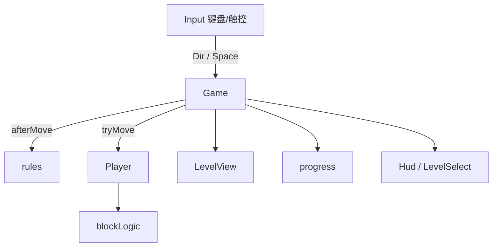

# 翻砖块（thebox）架构说明

面向后续开发与 agent：读完本文即可定位改规则、加关卡、加玩法应动哪些文件。

仓库：https://github.com/lancelee2026/thecube  
站点品牌：thebox  
灵感：[Cuboid](https://www.thomasfriday.com/cuboid/)（Bloxorz 简化变体）  
现状：一期基础 + 二期机制（脆弱 / 桥 / 分裂 / 多层）+ 传送 + 崩塌，共 78 关。

---

## 1. 一句话总览

纯静态 Web 小游戏。`Game` 协调输入与胜负；`blockLogic` 用显式网格状态算翻转；`rules` 做胜负与开关（与验关共用）；`LevelView` / `Player` 负责 Three.js 表现；进度、选关与场景偏好走 `localStorage`。无后端、无 Workers。

---

## 2. 技术栈与运行

| 项 | 选择 |
|---|---|
| 语言 | TypeScript |
| 打包 | Vite 8 |
| 渲染 | Three.js（正交等距相机） |
| 动画 | `@tweenjs/tween.js`（`Group` 统一 `update`） |
| 部署 | Cloudflare Pages：`npm run build` → 输出 `dist/` |

```bash
npm install
npm run dev
npm run build
npm run check-levels   # 本地 BFS，不进 Pages 构建
```

注意：`package.json` 与 `package-lock.json` 必须同步，Pages 使用 `npm ci`。

---

## 3. 目录结构

```
翻砖块/
  index.html
  scripts/check-levels.ts   # BFS 验关（桥/分裂/层）
  src/
    main.ts
    style.css
    game/
      Game.ts           # 主循环、胜负、切关、撤销、分裂/层/桥
      blockLogic.ts     # 翻边、小方块、合并
      rules.ts          # 解析、effectiveCell、死亡/过关、开关
      levelTypes.ts     # LevelDef、WorldSnapshot、桥/开关/分裂元数据
      Level.ts          # 地图 mesh、桥显隐、层切换
      Player.ts         # 单砖 / 双小方块动画
      levels.ts         # 78 关 LEVELS
      progress.ts       # localStorage v2
      setup.ts / motion.ts
    input/Input.ts
    audio/Sfx.ts
    ui/hud.ts           # 提示条、过关反馈、切换按钮、章节选关
  docs/architecture.md
```

---

## 4. 运行时数据流



撤销快照类型为 `WorldSnapshot`（block / blockB / active / bridges / collapsed / layer），不是单块 `BlockState`。

---

## 5. 核心规则

### 5.1 砖块状态

```ts
type Ori = 'standing' | 'flatX' | 'flatZ';
interface BlockState { col: number; row: number; ori: Ori }
```

分裂后两颗小方块始终 `standing`，用 `nextCubeState` 每次移一格；相邻且都站立可 `mergeBlocks`。

### 5.2 胜负

| 条件 | 结果 |
|---|---|
| 站立且格为 `.` / `z` / `f` | 失败 |
| 躺倒且两格皆 `.`，或任一格 `z` | 失败 |
| 躺倒一格有效、一格 `.` | **半悬空存活** |
| 躺倒且两格皆 `o` | **过关** |
| 站立踩 `o` | 不算过关 |
| 分裂中任一小方块在 `.` / `z` | 失败（小方块可站在 `f` 上） |

### 5.3 关卡字符与元数据

| 字符 | 含义 |
|---|---|
| `@` | 起点（白砖） |
| `x` | 白砖 |
| `o` | 绿色目标（成对 `oo`） |
| `z` | 红砖 |
| `.` | 虚空 |
| `f` | 脆弱：躺过安全，站立失败 |
| `b` | 桥面（开/关由 `bridges` 状态决定） |
| `s` / `S` | 轻/重开关（可走） |
| `p` | 分裂台 |
| `t` | 传送台（仅整砖站立触发） |
| `c` | 裂砖：离开后塌掉（本关不恢复） |
| `u` | 楼梯（站立切换 `layers`） |

`LevelDef` 还可含 `bridges` / `switches` / `splitPads` / `teleports` / `layers` / `hint` / `chapter`。有 `layers` 时可省略 `map`。

轻开关：任意姿态踩到即 toggle。重开关：仅**整砖站立**（非小方块）才 toggle。

传送：仅**整砖站立**踩 `t` 时，整块出现在 `dest`（保持站立）；躺着或小方块不触发；落地后不连环传送。

崩塌：踩过 `c` 后**离开**该格，裂砖变为虚空；仍站在上面时安全；撤销可恢复。

楼梯：未分裂且站立踩 `u` 时 `layer = (layer+1) % n`；两层的 `u` 应对齐同一格。

设计关卡注意 Bloxorz **奇偶性**；改关后：

```bash
npm run check-levels
```

### 5.4 选关解锁

`progress.maxCleared`（1-based）。可选：`i <= maxCleared` 或 `i === maxCleared + 1`。  
存储键：`fan-zhuan-kuai-progress-v3`（可读 v2 / v1 迁移）。

### 5.5 场景偏好

选关面板提供「高空模式」和从属的「云雾挑战」，存储键为 `thebox:scene-prefs:v1`。`Game.ts` 负责读取、约束与持久化；`LevelView.setHighAltitude()` 只控制托盘 mesh 的退场；`setup.ts` 切换 WebGL 透明底、雾，并在高空中彻底关闭接影面。两项设置不得进入 `WorldSnapshot`，也不得影响规则、撤销、步数和星级。

---

## 6. 模块职责速查

| 模块 | 职责 |
|---|---|
| `Game.ts` | 编排；`afterMove` 处理开关/分裂/合并/换层；空格切换实体 |
| `Player.ts` | 翻转动画；`placeSplit` / `placeMerged` / `toggleActive` |
| `Level.ts` | mesh；`syncBridges`；`setLayer` |
| `rules.ts` | 与 `check-levels` 共用判定 |
| `hud.ts` | `setHint` / `setSwapVisible`；过关和全通关反馈；选关按 `chapter` 分组 |

---

## 7. 双端 UI 约定

- 竖屏 / 粗指针 / 宽 &lt; 900px：显示底部方向键
- 宽屏细指针：隐藏触控键
- 机制提示条 `#hint-mechanic`；分裂时显示「切换」
- 壳层中文；画布为唯一 3D 视图
- 场景开关 DOM 必须同时维护在 `index.html` 与 `xhs/index.html`；关闭高空模式时云雾挑战必须禁用并清空

### 7.1 玩家文案与分享文案

- 面向玩家的文字必须使用日常中文：直接说「翻进绿色终点」「横躺通过」「竖着站上去」，不展示 `toggle`、`layer`、`BFS` 等实现词或缩略语。
- 机制提示按「颜色或物件 → 要做什么 → 会发生什么」组织；一句只解释一个新规则。复杂机制可用两句，但先说变化，再说控制方式。
- 首关提示在 `Game.ts`；各章节首次机制提示在 `levels.ts` 的 `hint`；过关、全通关、锁关和选关提示在 `ui/hud.ts`。
- 页面标题、描述、分享卡片和结构化数据以 `index.html` 为单一文案源；安装描述同步维护在 `public/manifest.webmanifest`。
- 分享图使用版本化文件名。替换图片时新增 `public/og-YYYYMMDD.png`，再同步更新 `index.html` 中的 OG、Twitter、`itemprop` 和 JSON-LD 图片地址，避免平台缓存旧图。

---

## 8. 关卡分段

| 关号 | 章节 |
|---|---|
| 1–15 | 基础 |
| 16–23 | 脆弱 |
| 24–37 | 桥梁 |
| 38–48 | 分裂 |
| 49–55 | 多层 |
| 56–68 | 传送 |
| 69–78 | 崩塌 |

---

## 9. 常见改动清单

| 目标 | 文件 |
|---|---|
| 增删改关卡 | `levels.ts` → `npm run check-levels`（含「本章机关不可绕过」） |
| 改胜负 / 开关 | `rules.ts` |
| 改翻边 / 合并 | `blockLogic.ts`（慎改） |
| 改动画 | `Player.ts`、`motion.ts` |
| 改解锁 | `progress.ts`、`hud.ts` |
| 文案布局 | `index.html`、`style.css` |
| 改高空 / 云雾场景 | `Game.ts`、`Level.ts`、`setup.ts`、`style.css`，并同步双入口 HTML |
| 部署 | Pages：`npm run build` → `dist` |

---

## 10. 参考

- 原作：thomasfriday.com/cuboid
- 同类：Bloxorz（开关桥、脆弱砖、分裂、多层）
