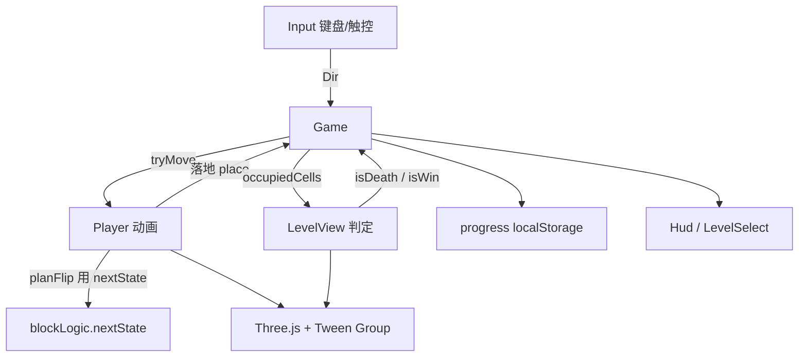

# 翻砖块（thecube）架构说明

面向后续开发与 agent：读完本文即可定位改规则、加关卡、加玩法应动哪些文件。

仓库：https://github.com/lancelee2026/thecube  
灵感：[Cuboid](https://www.thomasfriday.com/cuboid/)（Bloxorz 简化变体）  
分期：一期已交付；二期预留分裂传送、多层楼、脆弱砖、开关桥。

---

## 1. 一句话总览

纯静态 Web 小游戏。`Game` 协调输入与胜负；`blockLogic` 用显式网格状态算翻转；`LevelView` / `Player` 负责 Three.js 表现；进度与选关走 `localStorage`。无后端、无 Workers。

---

## 2. 技术栈与运行

| 项 | 选择 |
|---|---|
| 语言 | TypeScript |
| 打包 | Vite 8 |
| 渲染 | Three.js（正交等距相机） |
| 动画 | `@tweenjs/tween.js`（`Group` 统一 `update`） |
| 部署 | Cloudflare Pages：`npm run build` → 输出 `dist/` |

本地：

```bash
npm install
npm run dev      # 开发
npm run build    # tsc && vite build
```

注意：`package.json` 与 `package-lock.json` 必须同步，Pages 使用 `npm ci`，否则构建失败。

---

## 3. 目录结构

```
翻砖块/
  index.html              # HUD、画布、触控键、选关/通关浮层
  src/
    main.ts               # 入口：new Game()
    style.css             # 响应式布局、safe-area、触控显隐
    game/
      Game.ts             # 主循环、胜负、切关、撤销、存档
      blockLogic.ts       # ★ 纯逻辑：姿态、翻边、足迹格（无 Three）
      Level.ts            # 地图 mesh、isDeath / isWin、进出场特效
      Player.ts           # 翻转动画、fall / win、place / reset
      levels.ts           # ASCII 关卡数组 LEVELS
      progress.ts         # localStorage 进度与解锁判定
      setup.ts            # Scene / Renderer / Camera / 灯光 / resize
      motion.ts           # prefers-reduced-motion → 缩短时长
    input/Input.ts        # 键盘 + 屏幕方向键 → Dir
    audio/Sfx.ts          # WebAudio 短音，可静音
    ui/hud.ts             # Hud 文案；LevelSelect 选关网格
  docs/
    architecture.md       # 本文
```

改玩法规则优先动 `blockLogic.ts` + `Level.ts` 的判定；改关卡只动 `levels.ts`；改壳层 UI 动 `index.html` / `style.css` / `ui/hud.ts`。

---

## 4. 运行时数据流



单帧：`requestAnimationFrame` → `tweens.update(time)` → `renderer.render`。移动在动画中通过 `player.canMove` / `game.busy` 上锁。

---

## 5. 核心规则（一期，必须对齐）

### 5.1 砖块状态

```ts
type Ori = 'standing' | 'flatX' | 'flatZ';
interface BlockState { col: number; row: number; ori: Ori }
```

- `standing`：占 `(col, row)`，高 2
- `flatX`：占 `(col,row)` 与 `(col+1,row)`
- `flatZ`：占 `(col,row)` 与 `(col,row+1)`

网格：`col` → 世界 X，`row` → 世界 Z。翻边转移见 `nextState()`（标准 Bloxorz 查表，勿凭感觉改，否则关卡奇偶性会坏）。

### 5.2 胜负

实现：`LevelView.isDeath` / `isWin`。

| 条件 | 结果 |
|---|---|
| 站立且格为 `.` 或 `z` | 失败 |
| 躺倒且两格皆 `.` | 失败 |
| 躺倒且任一格为 `z` | 失败 |
| 躺倒一格有效、一格 `.` | **存活（半悬空）** |
| 躺倒且两格皆为 `o` | **过关** |
| 站立踩在 `o` 上 | 不算过关 |

失败：砖块缩小 + 路径 `shake`，重生起点。  
过关：旋转缩小 → 路径 `remove` → 自动下一关；最后一关弹出通关面板。

### 5.3 关卡字符

| 字符 | 含义 |
|---|---|
| `@` | 起点（同时是白砖） |
| `x` | 白砖 |
| `o` | 绿色目标（通常成对 `oo`） |
| `z` | 红砖，触碰即死 |
| `.` | 虚空 |

关卡是 `string[]`，每行一串；短行右侧按 `.` 补齐。起点站立。

设计关卡时注意 Bloxorz **奇偶性**：直线路径上站立格与躺倒覆盖范围受限。改关后建议对 `LEVELS` 做 BFS 可达性检查（本地曾用 `blockLogic` + 判定脚本校验）。

### 5.4 选关解锁

`progress.maxCleared`：已通关最高关号（**1-based**）；`0` 表示尚未通关。

- 可选：`i <= maxCleared`（已通关可重玩）或 `i === maxCleared + 1`
- 锁定：`i > maxCleared + 1`

存储键：`fan-zhuan-kuai-progress-v1`。

---

## 6. 模块职责速查

### `Game.ts`

编排中心。持有 `history: BlockState[]`（最多 50）做撤销；`moves` 本关步数、`totalMoves` 累计。  
快捷键：`R` 重开，`Z` / `Backspace` 撤销。

### `Player.ts`

用当前态与 `Dir` 算边枢轴，Tween 旋转 90°，结束后 `place(next)`。视觉尺寸来自 `blockSize`，中心来自 `worldCenter` + `LevelView.toWorld`。

### `Level.ts`

ASCII → mesh；`offsetX/Z` 居中整张图。特效：砖块 stagger 放大、失败抖动、过关缩小移除。

### `setup.ts`

背景色 `#3498db`；正交相机挂在 `cameraPivot` 上并绕 Y 旋转 `-π/2`（等距朝向）；`ResizeObserver` 缩放 canvas。

### `Input.ts` / `Sfx.ts` / `ui/hud.ts`

输入统一为 `Dir`。音效首次手势后解锁 AudioContext。选关三态样式：`cleared` / `next` / `locked`。

---

## 7. 双端 UI 约定

- 竖屏 / 粗指针 / 宽度低于 900px：显示底部方向键
- 宽屏细指针：隐藏触控键，依赖键盘
- `viewport` 禁止双击缩放；使用 `safe-area-inset-*`
- 壳层中文；画布为唯一 3D 视图

---

## 8. 二期扩展点（未实现）

| 玩法 | 建议落点 |
|---|---|
| 脆弱砖（站立碎） | 新字符；`isDeath` 增加「站立 + 脆弱」 |
| 轻/重开关 + 桥 | 关卡元数据或字符；`Game.afterMove` 切换桥格 |
| 分裂传送 | `Player` 改为可控实体列表；空格切换；合并判定 |
| 多层楼 | `BlockState` / 格子增加 `layer`；相机或层切换 |

一期刻意保持「单层、单砖、逻辑与渲染分离」，二期优先扩展 `blockLogic` 与关卡 schema，再改 `Player`。

---

## 9. 常见改动清单

| 目标 | 文件 |
|---|---|
| 增删改关卡 | `src/game/levels.ts` |
| 改半悬空 / 红砖 / 过关条件 | `src/game/Level.ts`（及文档本节） |
| 改翻边位移 | `src/game/blockLogic.ts`（慎改） |
| 改翻转动画手感 | `src/game/Player.ts`、`motion.ts` |
| 改解锁规则 | `src/game/progress.ts`、`ui/hud.ts` |
| 改按钮文案 / 布局 | `index.html`、`style.css` |
| 构建与部署 | `package.json`；Pages：`npm run build`，输出 `dist` |

---

## 10. 参考

- 原作关卡与规则对照：thomasfriday.com/cuboid（`levels.js` / `level.js` / `player.js`）
- 同类机制百科：Bloxorz（开关桥、脆弱砖、分裂块等，多属二期）
